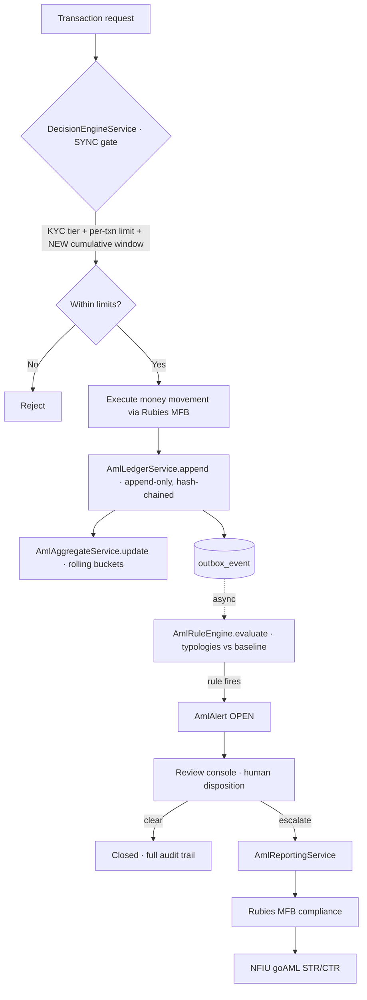

# Wisemonie — AML / Transaction-Monitoring Architecture

**Status:** design proposal · **Owner:** engineering · **Depends on:** existing `DecisionEngineService`, `transaction_logs`, `outbox_event`, Rubies MFB (BaaS)

---

## 0. Regulatory context — who reports?

Wisemonie operates on **Rubies MFB's** banking licence (BaaS/sponsor model). Under CBN's AML/CFT/CPF regime, the **licensed institution is the reporting entity**. Therefore:

- **Rubies MFB** files STRs/CTRs to the **NFIU** (Nigeria's FIU, which runs on the goAML platform). Wisemonie does **not** file to NFIU directly.
- **Wisemonie is the first line of defence.** We see transaction-level detail Rubies does not (envelope behaviour, budgeting intent, in-app velocity), so our contractual and practical job is to: run KYC/CDD, monitor transactions, maintain the review queue, disposition alerts, and **escalate suspicious activity to Rubies** in the format/SLA their compliance team specifies. Rubies performs second-line review and files.
- **Record-keeping** stays with us regardless: KYC + transaction records, typically retained **≥ 5 years** (confirm the exact period Rubies passes down).

> This is why the fourth pillar is "escalate to Rubies", not "file to goAML". The engine below is identical either way; only the final hop changes.

**Confirm with Rubies before Phase 4** (see §10): escalation channel + format, SLA/deadline for suspicious-activity reporting, retention period, and any monitoring feeds they require from us proactively.

---

## 1. Design principles

1. **The transaction path is sacred.** Only *hard limits* run synchronously in the payment path (fast, deterministic). All *detective* monitoring runs asynchronously and can never add latency or failure to a payment.
2. **One immutable source of truth.** An append-only, hash-chained ledger is the audit spine. Everything else (aggregates, alerts) is derived and reconcilable back to it.
3. **Rules are data, not code.** Thresholds and windows live in a `aml_rule` table (versioned), so tuning is config, not a redeploy — and every alert records the rule *version* that fired.
4. **Reuse what exists.** Hook the ledger into the money-movement points we already have; reuse the `outbox_event` pattern for async evaluation; extend `DecisionEngineService` rather than replacing it.
5. **Code is necessary, not sufficient.** The engine feeds a human review process and Rubies' filing obligation. We build the machine; the compliance program (officer, disposition, escalation) runs on top of it.

---

## 2. Component overview



Two lanes:
- **Sync lane (left):** `DecisionEngineService` gates the transaction on KYC tier + per-transaction limit (exists today) **+ cumulative window limit (new)**.
- **Async lane (right):** every settled money movement appends to the ledger, updates rolling aggregates, and emits an event that the rule engine consumes off the hot path.

---

## 3. Data model

All new tables are prefixed `aml_`. Money is `NUMERIC(19,4)`.

### 3.1 `aml_ledger_entry` — the audit spine (append-only)

| column | type | notes |
|---|---|---|
| `id` | BIGSERIAL PK | |
| `seq` | BIGINT | monotonic sequence for the hash chain |
| `entry_time` | TIMESTAMPTZ | when the money actually moved |
| `user_id` | BIGINT | |
| `account_ref` | VARCHAR | Rubies virtual account / wallet id |
| `direction` | VARCHAR(6) | `DEBIT` \| `CREDIT` |
| `amount` | NUMERIC(19,4) | |
| `balance_after` | NUMERIC(19,4) | for reconciliation |
| `txn_type` | VARCHAR | `FUNDING`, `ENVELOPE_DISBURSE`, `BUDGET_REFUND`, `SAVINGS_LOCK`, `SAVINGS_MATURE`, `WITHDRAWAL_SETTLED`, `WITHDRAWAL_REVERSED` … |
| `source_table` | VARCHAR | `transaction_logs` \| `withdrawal` \| … |
| `source_id` | BIGINT | link back to the operational row |
| `counterparty` | JSONB | external bank/account on funding & withdrawal |
| `prev_hash` | CHAR(64) | previous entry's `entry_hash` |
| `entry_hash` | CHAR(64) | `SHA-256(prev_hash ‖ canonical(this row))` |
| `created_at` | TIMESTAMPTZ | insert time |

- **Idempotency:** `UNIQUE(source_table, source_id, direction)` — a webhook retry can't double-write.
- **Append-only enforcement:** the app's runtime DB role is granted `INSERT` only on this table (no `UPDATE`/`DELETE`). Optionally a `BEFORE UPDATE/DELETE` trigger that raises.
- **Tamper-evidence:** the hash chain means any retro-edit breaks every subsequent `entry_hash`. Optionally publish a daily root hash somewhere external.

> Relationship to `transaction_logs`: keep `transaction_logs` as the *operational* record (it drives product features). The ledger is a *derived, immutable* audit layer fed from the same events and cross-linked via `source_id` for reconciliation. We don't rip anything out.

### 3.2 `aml_user_window` — rolling aggregates (materialized cache)

Bucketed counters make velocity/structuring checks O(1) instead of scanning the ledger on every transaction.

| column | type | notes |
|---|---|---|
| `user_id` | BIGINT | |
| `bucket` | VARCHAR | `HOUR` \| `DAY` |
| `bucket_start` | TIMESTAMPTZ | truncated to the hour/day |
| `inflow` | NUMERIC(19,4) | credits |
| `outflow` | NUMERIC(19,4) | debits |
| `external_outflow` | NUMERIC(19,4) | withdrawals to bank only |
| `txn_count` | INT | |
| `updated_at` | TIMESTAMPTZ | |

PK `(user_id, bucket, bucket_start)`.

- **24h window** = sum trailing 24 `HOUR` buckets. **30d window** = sum trailing 30 `DAY` buckets.
- Source of truth stays the ledger; a nightly job reconciles buckets against `aml_ledger_entry` and alerts on drift.

### 3.3 `aml_rule` — versioned rule config

| column | type | notes |
|---|---|---|
| `id` | BIGSERIAL PK | |
| `code` | VARCHAR UNIQUE | e.g. `STRUCTURING_24H` |
| `typology` | VARCHAR | `STRUCTURING`, `PASS_THROUGH`, `VELOCITY`, `RAPID_IN_OUT`, `THRESHOLD`, `FAN_OUT`, `DORMANT_REACTIVATION` |
| `params` | JSONB | thresholds, windows, e.g. `{"windowHours":24,"cumCap":1000000,"minSubTxns":3}` |
| `severity` | VARCHAR | `LOW` \| `MEDIUM` \| `HIGH` |
| `enabled` | BOOLEAN | |
| `version` | INT | bumped on every param change |
| `updated_at` | TIMESTAMPTZ | |

### 3.4 `aml_alert` — detective output + review state machine

| column | type | notes |
|---|---|---|
| `id` | BIGSERIAL PK | |
| `user_id` | BIGINT | |
| `rule_code` / `rule_version` | VARCHAR / INT | exactly what fired |
| `typology` | VARCHAR | |
| `severity` / `score` | VARCHAR / NUMERIC | |
| `status` | VARCHAR | `OPEN → IN_REVIEW → (CLEARED \| ESCALATED) → REPORTED` |
| `trigger_source` / `trigger_ref` | VARCHAR / BIGINT | the ledger entry or txn that tripped it |
| `context` | JSONB | snapshot of the values that tripped the rule |
| `assigned_to` | BIGINT | reviewer |
| `disposition` / `disposition_note` | VARCHAR / TEXT | |
| `created_at` / `updated_at` / `resolved_at` | TIMESTAMPTZ | |

- **Dedup:** don't raise the same `(user_id, rule_code)` twice while one is still open — increment a hit counter on the open alert instead.

### 3.5 `aml_report` — record of escalation to Rubies

| column | type | notes |
|---|---|---|
| `id` | BIGSERIAL PK | |
| `alert_id` | BIGINT | (later: `case_id` when alerts are grouped) |
| `user_id` | BIGINT | |
| `submitted_to` | VARCHAR | `RUBIES_MFB` |
| `payload` | JSONB | what we sent |
| `external_ack` | VARCHAR | Rubies' acknowledgement id |
| `status` | VARCHAR | `QUEUED` \| `SENT` \| `ACKED` \| `FAILED` |
| `submitted_by` / `submitted_at` | BIGINT / TIMESTAMPTZ | |

---

## 4. Services

```
AmlLedgerService      append(cmd): LedgerEntry            // idempotent, hash-chained; the ONE write path
AmlAggregateService   onLedgerAppended(entry)             // update HOUR/DAY buckets
                      window(userId, WindowType): Stats   // read for gate + rules
AmlLimitService       checkCumulative(userId, amount, dir, tier): LimitDecision   // SYNC
AmlRuleEngine         evaluate(AmlEvent): List<Alert>     // ASYNC, reads enabled aml_rule rows
AmlAlertService       raiseOrDedup(...), transition(...)  // state machine
AmlReportingService   escalate(alertId): Report           // package + send to Rubies
```

- **`RuleEvaluator` interface**, one implementation per typology:
  ```java
  interface RuleEvaluator {
      String typology();
      Optional<Alert> apply(AmlEvent event, UserWindowStats stats, RuleConfig cfg);
  }
  ```
  `AmlRuleEngine` loads enabled `aml_rule` rows, dispatches to the matching evaluator, collects alerts. New typology = new class + a config row, no engine change.

- **Integration points** — where `AmlLedgerService.append(...)` is called (all existing money-movement points):
  - Wallet funding confirmed (Rubies inbound webhook) → `CREDIT FUNDING`
  - Budget creation debit / envelope disbursement → `DEBIT ENVELOPE_DISBURSE`
  - **Budget refund on delete** (the soft-delete flow) → `CREDIT BUDGET_REFUND`
  - Savings lock / maturity rake → `DEBIT SAVINGS_LOCK` / `CREDIT SAVINGS_MATURE`
  - Withdrawal settled/reversed (webhook) → `DEBIT WITHDRAWAL_SETTLED` / `CREDIT WITHDRAWAL_REVERSED`

---

## 5. Enforcement path — sync vs async (the key decision)

| | runs where | blocks payment? | examples |
|---|---|---|---|
| **Hard limits** | inside `DecisionEngineService`, pre-transaction | **yes** | per-txn tier cap (exists), **cumulative 24h/30d cap by KYC tier (new)** |
| **Detective monitoring** | off the hot path, via `outbox_event` | **no** | structuring, pass-through, velocity, fan-out |

`DecisionEngineService` today: KYC gate + per-transaction tier limit + balance/ownership. **Add one call:** `AmlLimitService.checkCumulative(...)`, which reads `AmlAggregateService.window(userId, DAY/MONTH)` and compares against the tier's cumulative cap. This is what catches **structuring** (many sub-threshold transfers) — a per-transaction check can never see it.

Everything else observes after commit: the ledger append emits an `outbox_event`; a worker hands it to `AmlRuleEngine`. Latency-tolerant, retryable, reprocessable, and a failure there never fails a payment.

---

## 6. Typologies that matter for Wisemonie

Encoded as `aml_rule` rows (params illustrative — **calibrate against real traffic + Rubies' guidance**):

| code | typology | fires when |
|---|---|---|
| `PASS_THROUGH_24H` | pass-through | funding then withdrawal within N hours with little/no budgeting or envelope use in between — **wallet-as-conduit, our signature risk** |
| `STRUCTURING_24H` | structuring | ≥ K sub-threshold transactions summing over a cumulative cap inside the window |
| `RAPID_IN_OUT` | rapid in/out | inflow and matching external outflow within a short interval |
| `VELOCITY_BASELINE` | velocity | txn count/volume ≫ the user's own trailing baseline |
| `FAN_OUT` | fan-out | one account funding many distinct withdrawal destinations |
| `THRESHOLD_CTR` | threshold | single transaction over the regulatory reporting threshold (CTR candidate) |
| `DORMANT_REACTIVATION` | dormancy | sudden high activity after a long dormant period |

The **pass-through** rule is the one that maps directly to the product concern raised earlier (funding the wallet, not budgeting, then withdrawing). It only works because the ledger + aggregates let us see "money in, money out, no budgeting in between."

---

## 7. Audit-grade ledger — tamper-evidence & reconciliation

- **Append-only** at the DB-role level (`INSERT` grant only) + optional trigger guard.
- **Hash chain**: `entry_hash = SHA-256(prev_hash ‖ canonical_json(entry))`. Any retro-edit breaks the chain from that point on.
- **Reconciliation job (nightly):**
  1. Ledger balances per user must equal wallet + envelope + savings balances → drift raises an operational alert.
  2. `aml_user_window` buckets must equal a fresh sum from the ledger → rebuild + alert on drift.
- **Retention:** never hard-delete AML rows. (Note: this is exactly why budgets are now *soft-deleted* — the audit trail must survive account/budget deletion.)

---

## 8. Escalation to Rubies MFB (the "export" pillar)

Because Rubies is the reporting institution, `AmlReportingService` does **not** talk to NFIU. On a reviewer's **escalate** disposition it:

1. Packages the case: user KYC snapshot, the alerts + rule versions, the relevant ledger slice, and the reviewer's narrative.
2. Submits to Rubies via the channel their compliance team specifies (API / secure portal / designated contact), recording everything in `aml_report` with their acknowledgement id.
3. Rubies performs second-line review and files the STR/CTR with NFIU (goAML).

We keep the full record on our side for the retention period. **The exact payload shape and channel are a Rubies dependency — do not build this pillar until confirmed (§10).**

---

## 9. Build sequence

Each phase is useful on its own and feeds the next.

| Phase | Deliverable | Why first |
|---|---|---|
| **1** | `AmlLedgerService` + `aml_ledger_entry` (append-only, hash-chained) + reconciliation job | The foundation everything reads from; hardens existing data immediately |
| **2** | `AmlAggregateService` + `AmlLimitService`, wired into `DecisionEngineService` | Cumulative caps = immediate risk reduction; catches structuring the per-txn check misses |
| **3** | `AmlRuleEngine` + `aml_rule` + `aml_alert` (async via `outbox_event`) | Detective typologies, now that the ledger + aggregates exist to read |
| **4** | Review console (admin UI) + `AmlReportingService` → Rubies | Needs alerts worth reviewing, and Rubies' confirmed format |

---

## 10. Open questions to confirm with Rubies MFB

Before Phase 4 (and to calibrate Phases 2–3):

- [ ] Suspicious-activity **escalation channel + payload format** (API? portal? contact?).
- [ ] **SLA/deadline** for escalating suspicious activity to them.
- [ ] **Record retention period** they require us to hold (KYC + transactions).
- [ ] Do they require **proactive monitoring feeds/CTRs**, or only dispositioned suspicious cases?
- [ ] **Cumulative caps & CTR threshold** per KYC tier — their numbers, not ours.
- [ ] Who is Wisemonie's designated **compliance contact / reviewer** (the human in Phase 4)?

---

## 11. What's code vs. not-code

- **Code (this doc):** the ledger, aggregates, limits, rule engine, alerts, review-queue state machine, escalation plumbing.
- **Not code:** rule *calibration* (empirical + regulatory), the *human* who dispositions alerts, the escalation *SLA*, and Rubies' filing. The engine makes the program possible; it doesn't discharge the obligation.

> Nothing in this document is legal or compliance advice. Thresholds, typologies, retention, and reporting obligations must be validated against current CBN AML/CFT/CPF regulations and Rubies MFB's compliance requirements.
